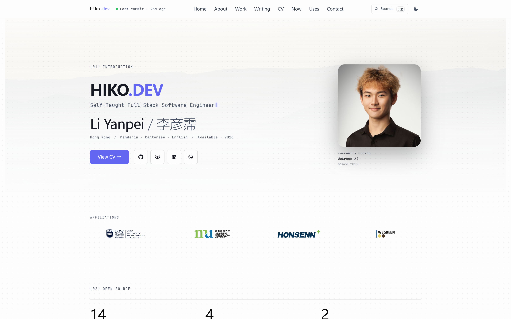
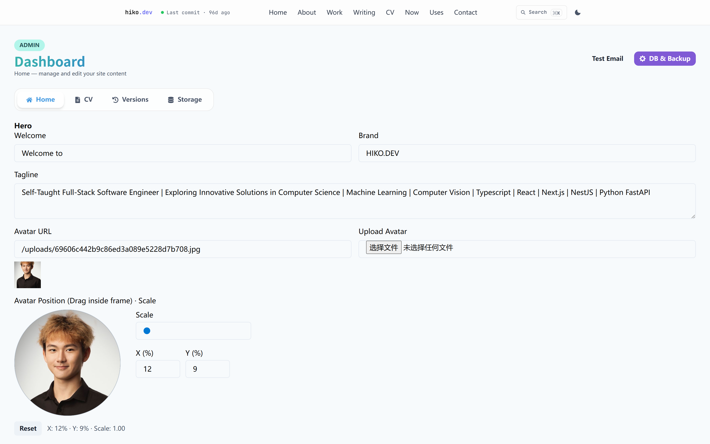
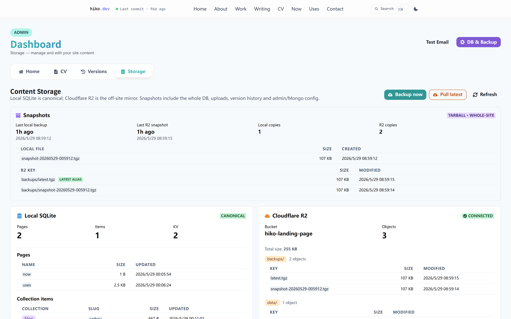
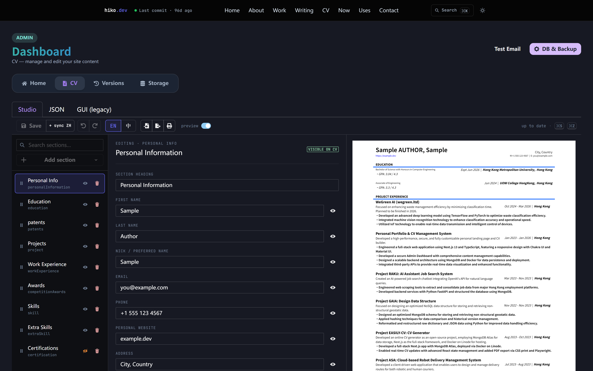

<div align="center">

# Portfolio Studio · 个人作品集工作台

**可自托管、内容驱动的个人站点 + 后台编辑工作台。**
本地优先 SQLite、Cloudflare R2 异地镜像、MDX 内容层、MongoDB 备份，
以及面向非工程师的硬化后台 GUI。

English → [README.md](./README.md)

[](https://github.com/hiko-server/landing_page)
[](https://nextjs.org/)
[](https://www.typescriptlang.org/)
[](https://chakra-ui.com/)
[](https://www.sqlite.org/)
[](https://developers.cloudflare.com/r2/)
[](https://www.docker.com/)
[](LICENSE)



</div>

---

## 项目亮点

- **本地优先内容存储**：`data/content.db` 中的 SQLite 是真源；Cloudflare R2
  作为异地镜像；文件系统中的 MDX/JSON 仅作单向种子。每次后台写入都会
  **同步**落 DB，并**尽力**同步推 R2。
- **一键全站快照**：`lib/backup.ts` 把 SQLite（通过 SQLite Online Backup
  API，WAL 一致）、上传图片、版本历史快照和管理员/Mongo 配置打成单个
  gzip tarball；后台提供「立即备份」「拉取最新」两枚按钮。
- **MDX 内容层**：`/blog`、`/work`（案例研究）、`/now`、`/uses` 全部由
  类型化 MDX 集合驱动，自动生成 OG 图、RSS 与阅读时长。
- **双语 CV**：`/about` 与 `/cv` 提供 English / 中文 切换；同一份
  `data/cvdata.json`，共享字段零重复翻译，并带滚动版本历史。
- **面向非工程师的后台**：可视化编辑 Hero、品牌、社交、照片墙、博客、
  案例研究、CV（分屏 Studio + 原始 JSON + 旧版 GUI），以及 Now/Uses。
- **逐节可见性开关**：首页所有 `[NN]` 板块（Open Source / Tech Stack /
  Activity / Projects / Experience / Certs / Photos / Contact）都可
  从后台直接隐藏，无需改代码。
- **联系面板可编辑**：标题、眉标、副标语、原因下拉项均来自
  `data/home.json`；留空时回退到内置默认值。
- **工业级后台认证**：scrypt + 16 字节随机盐；按账户锁定（15 分钟
  内 10 次失败 → 锁 15 分钟）；按 IP 限流；`httpOnly` + `SameSite=Strict`
  + `Secure` Cookie；通过 `jose` 在 Edge Middleware 校验 JWT，未登录
  访客**完全无法看到**任何 admin 页面；统一下发 HSTS / CSP / X-Frame /
  X-Robots。

<table>
<tr>
<td></td>
<td></td>
</tr>
<tr>
<td align="center"><sub>后台 → Home：可见性开关 + 内容字段</sub></td>
<td align="center"><sub>后台 → Storage：本地 SQLite + R2 镜像 + tarball 快照</sub></td>
</tr>
</table>

---

## 技术栈

| 层 | 选型 | 取舍说明 |
|---|---|---|
| 框架 | **Next.js 13（Pages Router）** | 成熟的 SSR、文件式 API、Edge Middleware |
| UI | **Chakra UI 2** | 可组合原语，开箱即用的深色模式 |
| 动效 | **Framer Motion** | Hero 入场、分节 reveal |
| 内容存储 | **better-sqlite3** + **Cloudflare R2** | 本地优先 + 廉价异地副本 |
| 写作 | **MDX**（`next-mdx-remote` + `rehype-pretty-code`） | 带语法高亮的长文 |
| 备份 tarball | **`tar-stream` + `node:zlib`** | 单文件原子快照 |
| 备份目标（可选） | **MongoDB GridFS** | 已配置时镜像图片 + JSON |
| 邮件 | **Nodemailer** | 联系表单 + 密码重置 |
| 鉴权 | **scrypt + `jsonwebtoken` + `jose`（Edge）** | 锁定感知登录、Edge JWT 校验 |
| 编辑器 | **TipTap**（富文本） + 类 Monaco JSON | 文章块编辑器 + 原始 JSON CV |

---

## 目录结构

```
.
├── components/          # UI 原子 / 分子 / 组织级组件
│   ├── Admin/           # HomeEditor / CVEditorStudio / StoragePanel …
│   ├── LandingPage/     # PersonalInfo / Content / ExperienceTimeline …
│   └── …
├── content/             # MDX 种子（首次读取时单向 → DB）
│   ├── blog/*.mdx
│   ├── work/*.mdx
│   ├── now.mdx
│   └── uses.mdx
├── data/                # 运行时状态 — 已 .gitignore
│   ├── content.db       # SQLite 真源
│   ├── home.json        # Hero / 社交 / 品牌 / 照片墙的 KV 种子
│   ├── cvdata.json      # CV en/zh 真源
│   ├── admin.json       # 本地管理员记录（hash + salt）
│   ├── *_snapshots/     # 每类内容的版本历史
│   └── backups/         # snapshot-<UTC>.tgz
├── lib/                 # 服务端工具库
│   ├── backup.ts        # 快照打包 / 解包流水线
│   ├── admin.ts         # scrypt + 锁定感知验证
│   ├── home.ts          # HomeData schema + 分节键
│   ├── currentlyCoding.ts # 从 CV 推导芯片内容
│   ├── db.ts / r2.ts / contentStore.ts
│   └── env.ts / rateLimit.ts / mailer.ts
├── pages/
│   ├── api/             # 全部服务端接口
│   │   ├── admin/       # 需鉴权：storage / posts / work / page …
│   │   ├── auth/        # email-login / request-reset / reset-password
│   │   ├── contact*     # 联系表单 + nonce
│   │   └── home / cvdata / mongo / og …
│   ├── admin/           # 需鉴权 UI：dashboard / login / forgot / reset …
│   ├── blog/ / work/ / now / uses / about / cv …
│   └── index.tsx
├── scripts/             # CLI（migrate / push / pull / list）
├── middleware.ts        # 安全响应头 + 后台鉴权门
└── public/              # 静态资源
```

---

## 快速开始

### 1. 拉取与安装

```bash
git clone https://github.com/hiko-server/landing_page.git
cd landing_page
yarn          # 或 npm install / pnpm install
```

### 2. 配置环境变量

```bash
cp .env.example .env
# 编辑 .env — 至少设置 ADMIN_EMAIL / ADMIN_PASS / JWT_SECRET
# JWT_SECRET 可用：
# node -e "console.log(require('crypto').randomBytes(32).toString('base64'))"
```

### 3. 初次本地种子

```bash
yarn content:migrate    # 把 content/*.mdx + data/*.json 写入 data/content.db
```

### 4. 开发模式

```bash
yarn dev                # localhost:3002（或 PORT 环境变量）
```

访问：
- `/` — 首页
- `/admin/login` — 后台入口（**隐蔽**：导航中**故意**不放可见链接）

### 5. 生产模式

```bash
yarn build && yarn start
```

或使用 Docker：

```bash
docker compose up --build
```

---

## 环境变量

完整说明见 [`.env.example`](./.env.example)。重点：

| 分组 | 变量 | 是否必填 |
|---|---|---|
| 管理员引导 | `ADMIN_EMAIL`、`ADMIN_PASS` | ✅ 仅首次启动；落盘后可删 |
| 会话 | `JWT_SECRET`（base64，≥ 32 字节） | ✅ 始终必填 |
| 站点身份 | `NEXT_PUBLIC_PRODUCT_NAME`、`NEXT_PUBLIC_SITE_HOST`、`SITE_URL` | 推荐填 |
| 邮件 | `SMTP_HOST/PORT/USER/PASS`、`FROM_EMAIL`、`NOTIFY_EMAIL` | 可选 — 未设置时静默跳过 |
| 联系验证码 | 无 — 内置 nonce + 数学题 + 蜜罐 | 不适用 |
| GitHub | `GITHUB_TOKEN`（只读 PAT） | 推荐（API 限额 60 → 5000/h） |
| MongoDB 备份 | `MONGODB_URI`、`MONGODB_DB_NAME` | 可选 |
| Cloudflare R2 | `R2_ENDPOINT`、`R2_BUCKET`、`R2_ACCESS_KEY_ID`、`R2_SECRET_ACCESS_KEY`、`R2_REQUIRED` | 可选 |
| 功能开关 | `ENABLE_DEMO` | 可选 |

> 仓库里**永远不会**提交真实 `.env`。`.env.example` 仅含占位值 — 拷贝
> 一份再按自己的部署填即可。

---

## 架构

### 内容存储（本地优先）

```
                ┌─────────────┐
   后台 GUI  ──▶│ /api/home   │──┐
                │ /api/admin/*│  │
                └─────────────┘  │ 双写
                                 ▼
            ┌──────────────────────────────┐
            │ SQLite (data/content.db)     │  ← 真源
            └──────────────────────────────┘
                                 │ 尽力
                                 ▼
            ┌──────────────────────────────┐
            │ Cloudflare R2                │  ← 异地镜像
            │ pages/*.mdx, blog/, work/,   │
            │ data/*.json, uploads/,       │
            │ backups/snapshot-<UTC>.tgz   │
            └──────────────────────────────┘
```

- **读取**优先走 SQLite；DB 缺失时回退文件系统并把结果写回 DB（自动种子）。
  仓库继续保留 `content/*.mdx` 与 `data/*.json` 作为基线。
- **写入**是双写：SQLite 必须成功；R2 推送是 best-effort，失败时通过
  `r2Warning` 返回（运营者知道镜像断了，但**绝不丢数据**）。
- **容器启动**先跑 `scripts/sync-from-r2.mjs`（生产建议设
  `R2_REQUIRED=1` 让缺 R2 时立即失败，否则只警告然后继续）。

### 备份流水线

`lib/backup.ts` 打包的全站原子快照：

```
MANIFEST.json
db/content.db          ← 经 SQLite Online Backup API（WAL 一致）
data/admin.json
data/mongo_config.json
data/snapshots/{cv,home,blog,work,page}_snapshots/**
uploads/*
```

流水线：`tar pack → gzip → fs.WriteStream → 原子 rename`。本地副本写到
`data/backups/snapshot-<UTC>.tgz`；如果 R2 已配置，再推到
`backups/<UTC>.tgz` 与 `backups/latest.tgz`（后者作为低成本的「拉取目标」）。

恢复是对称的：先解到同级临时目录，关闭活跃 DB 句柄，替换文件，再把
其它目录镜像回活跃树。

<div align="center">
  
</div>

### 后台安全

- **Edge Middleware**（`middleware.ts`）：在任何 `/admin/*` 页面或
  `/api/admin/*` 接口渲染**之前**用 `jose` 校验 `cv_admin_token` JWT。
  未登录访问 → 页面 302 到 `/admin/login?next=<原路径>`；接口直接返
  JSON 401。公开白名单：`/admin/{login,forgot,reset}` 与
  `/api/admin/{session,logout}`。
- **scrypt** 密码哈希（N=16384、r=8、p=1、64 字节 key），每账户独立的
  16 字节随机盐。比较一律走 `crypto.timingSafeEqual` 且两侧 buffer 等长。
- **账户级锁定**：15 分钟滚动窗口内 10 次失败即锁 15 分钟，攻击者轮
  换 IP 也无效。状态存 `data/admin.json`。登录成功立即清零计数。
- **IP 级限流**（登录 10/5min、重置请求 5/10min、联系表单 5/10min）。
- **同源校验**：生产环境下 `POST /api/auth/email-login` 强制
  `Origin === Host`，作为 `SameSite=Strict` 之上的纵深防御。
- **JWT** 走 HS256，7 天有效期，签名密钥 `JWT_SECRET`。
- **Cookie**：`httpOnly`、`sameSite: 'strict'`、生产开 `secure`、`path: /`。
- **重置 Token**：24 字节随机、30 分钟 TTL、一次性、常量时间比较、
  每次读取自动清理过期项。
- **后台页面**：统一下发 `X-Robots-Tag: noindex, nofollow, noarchive`
  和 `Cache-Control: no-store`，让搜索引擎与中间缓存都收不到。

### 分节可见性

首页所有 `[NN]` 板块都过一遍 `isSectionVisible(home, key)`，
`key ∈ {introduction, brands, open-source, tech-stack, activity, projects,
experience, certifications, photos, contact}`。键缺失默认**显示**——
新装实例自带完整页面。

入口：**后台 → Home → Visibility**。

### Currently-coding 芯片

头像下方的三行小字（`label / project / note`）。每行独立按
**后台手填 → 从 CV 自动推 → 留空**的优先级合并：

- 后台手填非空 → 用手填值。
- 否则由 `lib/currentlyCoding.ts` 从 `data/cvdata.json` 自动推导：
  - `label` → `"currently coding"`
  - `project` → 「当前最相关」的 `workExperience.companyName`
    （优先在职岗位，按开始日期升序取最长持续者；都已结束则取
    最近一份）
  - `note` → `"since <最早年份>"`，取所有带日期 CV 条目的最小年份
- 三行合并值**全为空**时整个芯片才会隐藏。

后台编辑器把自动推导值作为输入框的 placeholder 显示，并在下方加一行
小字 `Auto-derived now: …`，让运营者一眼看到「留空时访客会看到什么」。

---

## CLI 脚本

```bash
yarn content:migrate    # 文件系统 → SQLite（幂等）
yarn content:pull       # R2 → SQLite（覆盖；读 .env）
yarn content:push       # SQLite → R2（覆盖；读 .env）
yarn content:list       # 列出 R2 对象
```

---

## Docker

```bash
docker compose up --build
```

自带的 `docker-entrypoint.sh` 在容器启动时先跑 `sync-from-r2.mjs`，
所以**新容器会自动从 R2 镜像水合**。建议把 `./data` 挂成卷，跨重建
保留本地 SQLite 与上传图。

`.env` 中的构建参数（R2_*、MONGODB_*、SMTP_*、ADMIN_*、JWT_SECRET）
会直接透传。

---

## 公开路由

| 路由 | 说明 |
|---|---|
| `/` | 首页 — 按可见性组合 `[NN]` 板块 |
| `/about` | 长版本介绍 + GitHub 数据 + 双语 CV 栈 |
| `/cv` | 可打印 CV（浏览器另存 PDF） |
| `/work` | 案例研究索引（MDX） |
| `/work/[slug]` | 单篇案例（封面 + 正文） |
| `/blog` | 博客索引 + 标签筛选 + RSS |
| `/blog/[slug]` | 单篇博文（语法高亮 + 阅读时长） |
| `/now` | 「最近在做什么」（MDX） |
| `/uses` | 工具、硬件、服务清单（MDX） |
| `/contact` | 独立联系页（与首页 [09] 同组件） |

API 在 `/api/*`；`/api/admin/*` 全部需要鉴权（Middleware 把关）。

---

## 后台页面（已鉴权）

| 路由 | 用途 |
|---|---|
| `/admin/login` | 登录（**隐蔽**入口：导航无可见链接；走 ⌘K 命令面板或直接输 URL） |
| `/admin/forgot` + `/admin/reset` | 邮件密码重置流程 |
| `/admin` | 入口卡片 |
| `/admin/dashboard?tab=home` | HomeEditor — Hero / Contact / 可见性 / 品牌 / 照片 |
| `/admin/dashboard?tab=cv` | CV Studio（分屏）+ 原始 JSON + 旧版 GUI |
| `/admin/dashboard?tab=versions` | 版本回滚 |
| `/admin/dashboard?tab=storage` | SQLite + R2 清单，手动 Backup / Pull |
| `/admin/blog`、`/admin/blog/edit?slug=…` | 博客管理 |
| `/admin/work`、`/admin/work/edit?slug=…` | 案例研究管理 |
| `/admin/now`、`/admin/uses` | 单页编辑器 |
| `/admin/db-config` | MongoDB 连接 + 手动备份/恢复 |

<div align="center">
  
  <br /><sub>后台 → CV → Studio：分屏编辑 + 实时预览</sub>
</div>

---

## 截图

推荐的截图放在 [`docs/screenshots/`](./docs/screenshots/) 目录。
按照[索引](./docs/screenshots/README.md)给出的文件名命名即可被
README 自动引用。**请勿提交**包含真实凭据、付费仪表盘或个人联系
方式的截图。

---

## 安全披露

发现安全问题请**不要**直接开 issue。建议走
[GitHub 私密安全公告流程](https://github.com/hiko-server/landing_page/security/advisories/new)
提交，或直接邮件给维护者。优先采用协调披露策略。

已知限制（设计取舍，已记录）：
- 内存级限流器在服务重启时清零。生产建议在反向代理或 Cloudflare
  侧再叠一层持久限流。
- 单部署只支持一个管理员账户。本项目是作品集 CMS，**不是**
  多租户 SaaS。

---

## 许可证

[MIT](./LICENSE) © 贡献者。

欢迎 fork 出自己的版本；改顺手了的话，记得提个 PR 回来。
